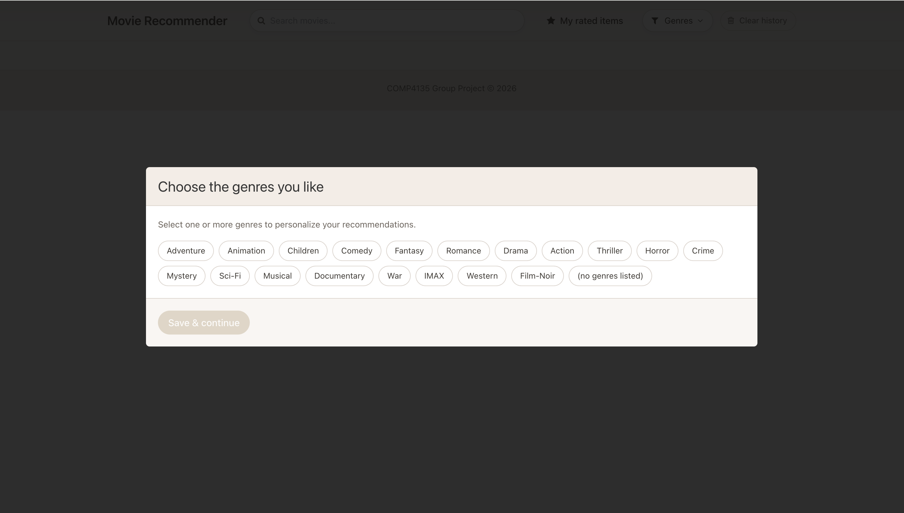
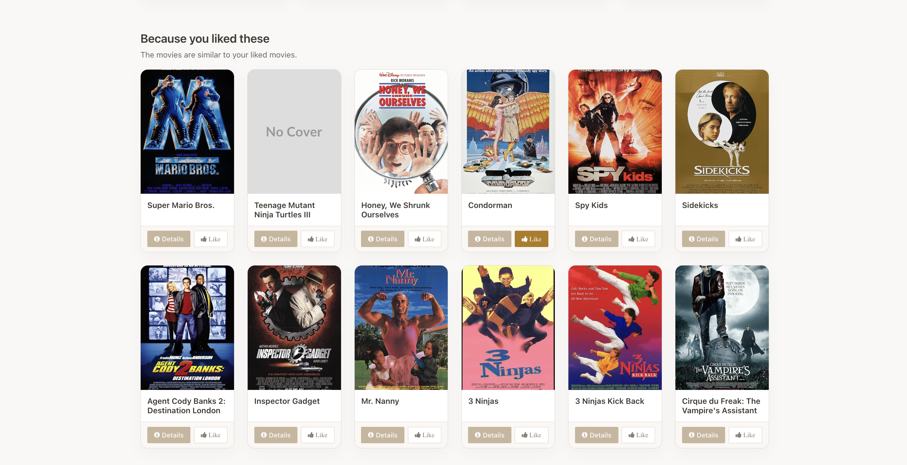
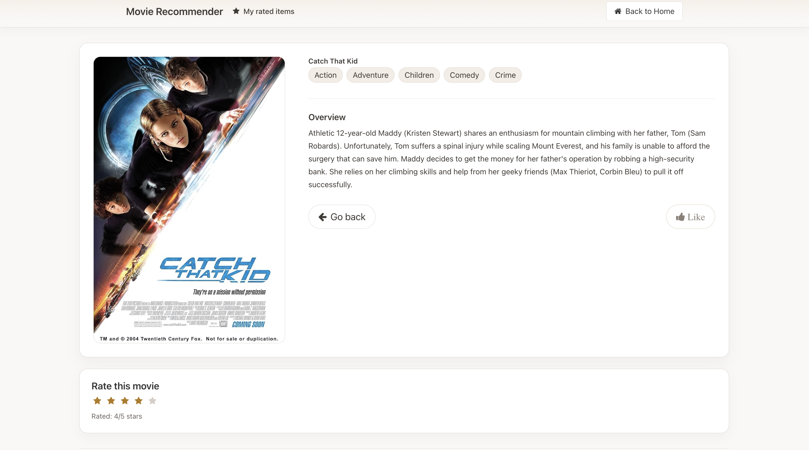
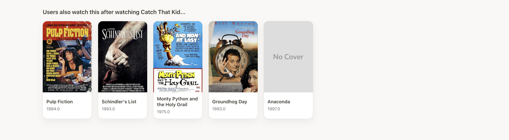
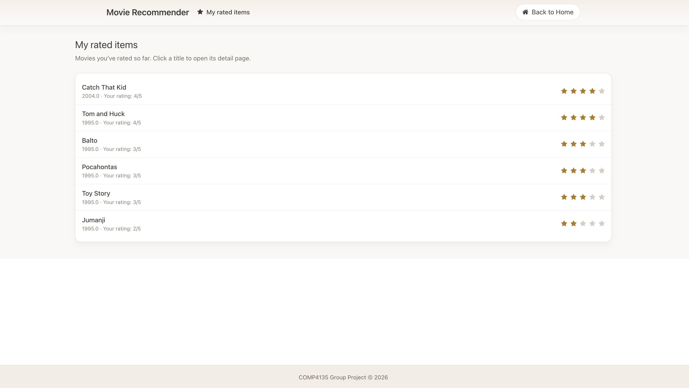

Instructions of running the recommender:

## Create an environment

# Movie Recommender — Project README

This repository contains a simple movie recommender web app built with Flask.

## Quick start

1. Create and activate a Python environment

```bash
conda create -n projectdemo python=3.11 -y
conda activate projectdemo
```

2. Install dependencies

```bash
pip install --upgrade setuptools wheel pyquery
conda install -c conda-forge scikit-surprise -y
pip install -r requirements.txt
```

3. Run the app

```bash
flask --app flaskr run
```

4. Open http://127.0.0.1:5000 in your browser.

## UI images


Example (repository-relative Markdown links):













